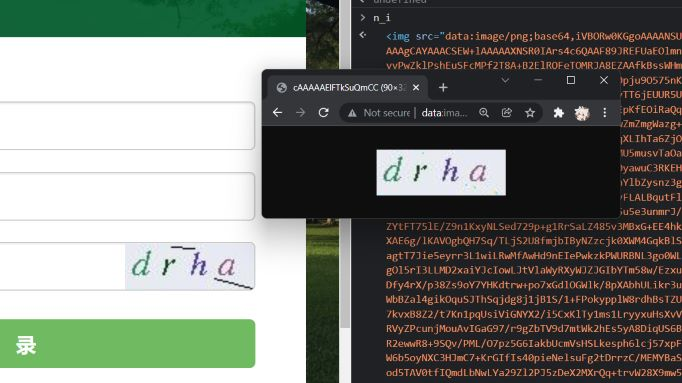
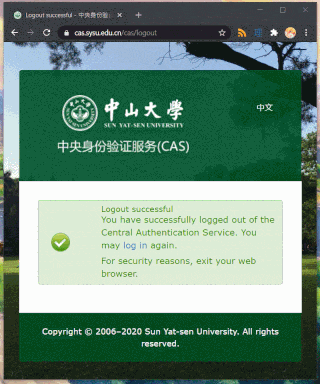

# SYSU-CAS
Automatically Login to CAS system of SYSU

## [Javascript](CasLogin.js)
### Greasy Fork
**[中大自动验证码认证][1]**

[SYSU CAS Auto Captcha Login][2]

#### Updates

* 2022-12-03: 现在可以通过在代码里填入密码以省去激活按钮的步骤 <br> [为什么之前必须点一下鼠标？][6]
* 2021-12-20: <br> 换用 gitee 及 cnpmjs 以显著提升加载速度 <br> 默认使用精简数据
* 2021-12-12: 添加了去除干扰线的功能，大幅提升验证码识别正确率。 <br><br> 

---



* Using [Tesseract.js][4] ([GitHub][5])
* Note: you'll download [data about 11M][3] at the first run.

## Python
### Example
(See [example.py](./example.py))
```python
from CasLogin import CasLogin, test_status

target_login_url = 'Your login web page redirecting CAS'
target_url = 'Your target page'
login_status = False  # Initialize


if __name__ == '__main__':
    login_cas = CasLogin()
    login_status = test_status(login_cas.main())
    while not login_status:
        login_status = test_status(login_cas.main())
    # Retry until Success
    
    login_to_target = login_cas.session.get(target_login_url, headers=login_cas.headers)
    get_target = login_cas.session.get(target_url, headers=login_cas.headers)
    print(get_target.text)
    
    login_cas.terminate()
    # Stop session, optional.
```

[1]: https://greasyfork.org/zh-CN/scripts/419757
[2]: https://greasyfork.org/en/scripts/419757
[3]: https://tessdata.projectnaptha.com/4.0.0/eng.traineddata.gz
[4]: https://tesseract.projectnaptha.com
[5]: https://github.com/naptha/tesseract.js
[6]: https://stackoverflow.com/questions/46268851
